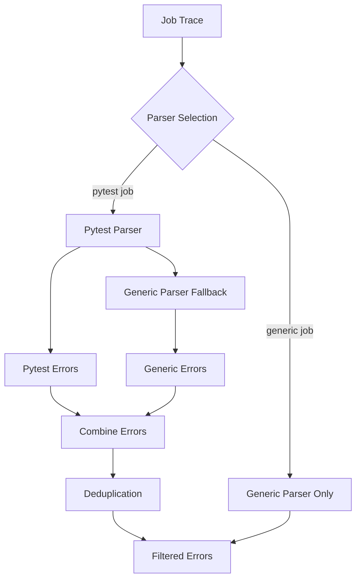

# Error Deduplication in GitLab Pipeline Analyzer

## Overview

The GitLab Pipeline Analyzer implements sophisticated error deduplication to prevent the same error from being reported multiple times when using hybrid parsing approaches. This is particularly important when combining pytest parser results with generic log parser results.

## Problem Statement

### The Duplicate Error Issue

When analyzing test job failures, the system uses a **hybrid parsing approach**:

1. **Pytest Parser**: Extracts detailed test failure information from pytest output
2. **Generic Log Parser**: Catches import-time errors, syntax errors, and other issues that occur before pytest runs

This approach can lead to the same error being reported twice:

- Once by the pytest parser (as a test failure with detailed context)
- Once by the generic parser (as a generic error from the raw logs)

### Example Duplicate

**Before Deduplication:**

```
Error 1 (Pytest Parser):
  Type: test_failure
  Message: FAILED domains/gwpy-document/.../test_effective_permissions.py::TestDocumentEffectivePermissions::test_user_permissions - AttributeError: 'TestUtils' object has no attribute 'buildUserBasicDTO'

Error 2 (Generic Parser):
  Type: python_error
  Message: 'TestUtils' object has no attribute 'buildUserBasicDTO'
  File: test_effective_permissions.py
  Line: 2111
```

**After Deduplication:**

```
Error 1 (Deduplicated):
  Type: python_error
  Message: 'TestUtils' object has no attribute 'buildUserBasicDTO'
  File: test_effective_permissions.py
  Line: 2111
```

## Deduplication Algorithm

### Core Logic

The deduplication is handled by the `_filter_duplicate_combined_errors()` function in `failed_pipeline_analysis.py`:

```python
def _filter_duplicate_combined_errors(errors: list) -> list:
    """Filter duplicates from combined error results"""
    seen_errors = set()
    filtered_errors = []

    for error in errors:
        # Extract and normalize core components
        core_message = extract_core_error_message(error)
        normalized_file = extract_and_normalize_file_path(error)

        # Create normalized key for comparison
        key = f"{core_message}|{normalized_file}".lower().strip()

        if key not in seen_errors:
            seen_errors.add(key)
            filtered_errors.append(error)
        else:
            # Skip duplicate
            continue

    return filtered_errors
```

### Key Components

#### 1. Core Message Extraction

Handles different error message formats:

**Pytest Format:**

```
"FAILED domains/.../test_file.py::TestClass::test_method - ErrorType: message"
```

Extracts: `"message"`

**Generic Format:**

```
"ErrorType: message"
```

Extracts: `"message"`

**Direct Format:**

```
"message"
```

Uses: `"message"` as-is

#### 2. File Path Normalization

**From pytest errors:**

- Extracts filename from FAILED message path: `domains/.../test_file.py` → `test_file.py`

**From generic errors:**

- Uses provided `file_path` field
- Normalizes to filename only: `path/to/test_file.py` → `test_file.py`

**Empty file paths:**

- For pytest errors, extracts from the FAILED message structure

#### 3. Key Generation

Creates a normalized comparison key:

```python
key = f"{core_message}|{normalized_file}".lower().strip()
```

**Example Keys:**

```
"'testutils' object has no attribute 'builduserbasicdto'|test_effective_permissions.py"
```

## Implementation Details

### Hybrid Parsing Flow



### When Deduplication Triggers

Deduplication only occurs when:

1. **Parser type is "pytest"** (hybrid parsing is used)
2. **Both pytest and generic parsers** return errors
3. **Combined error count > 0**

For generic-only jobs, no deduplication is needed since only one parser runs.

### Debug Output

The system provides detailed debug output when `MCP_DEBUG_LEVEL=2`:

```
🔧 DEDUPLICATION CALLED: 2 combined errors
🔍 Error 1: 'TestUtils' object has no attribute 'buildUserBasicDTO'...
  🔑 Key: 'testutils' object has no attribute 'builduserbasicdto'|test_effective_permissions.py
  ✅ Added as unique
🔍 Error 2: FAILED domains/gwpy-document/document/apps/documents/tests/test_effective_permis...
  📝 Extracted core: 'TestUtils' object has no attribute 'buildUserBasicDTO'
  📁 Extracted file from FAILED: test_effective_permissions.py
  🔑 Key: 'testutils' object has no attribute 'builduserbasicdto'|test_effective_permissions.py
  🚫 Filtered as duplicate
🎯 DEDUPLICATION RESULT: 1 unique errors (filtered 1 duplicates)
```

## Configuration

### Environment Variables

```bash
# Enable detailed debug output
export MCP_DEBUG_LEVEL=2

# Enable verbose debug output
export MCP_DEBUG_LEVEL=3
```

### Disable Deduplication (for debugging)

The deduplication logic can be bypassed by modifying the source, but this is not recommended for production use.

## Performance Impact

### Metrics

- **Processing Time**: Minimal overhead (< 1ms for typical error sets)
- **Memory Usage**: O(n) where n is the number of errors
- **Cache Impact**: Positive - fewer duplicate errors stored in database

### Optimization

The algorithm is optimized for:

- **Case-insensitive comparison** - handles different casing in error messages
- **File path normalization** - reduces false negatives from path differences
- **Early exit** - stops processing once duplicate is identified
- **Memory efficiency** - uses string keys instead of storing full error objects

## Testing

### Test Cases

The deduplication logic is tested with:

1. **Identical errors from different parsers**
2. **Similar errors with different formatting**
3. **Errors with different file path formats**
4. **Edge cases** (empty messages, missing file paths)

### Validation

```python
# Example test validation
original_errors = [pytest_error, generic_error]  # Same core error
filtered_errors = _filter_duplicate_combined_errors(original_errors)
assert len(filtered_errors) == 1  # Deduplication successful
```

## Troubleshooting

### Common Issues

#### False Positives (Over-deduplication)

**Symptom**: Different errors being marked as duplicates
**Cause**: Keys too generic
**Solution**: Enhance key generation with more specificity

#### False Negatives (Under-deduplication)

**Symptom**: Same error appearing multiple times
**Cause**: Keys too specific or message format differences
**Solution**: Improve message normalization

#### Debug Steps

1. **Enable debug output**: `MCP_DEBUG_LEVEL=2`
2. **Check key generation**: Look for 🔑 Key logs
3. **Verify message extraction**: Look for 📝 Extracted core logs
4. **Review file path extraction**: Look for 📁 Extracted file logs

### Monitoring

Use the following MCP tools to monitor deduplication effectiveness:

```bash
# Check analysis results
get_mcp_resource("gl://pipeline/{project_id}/{pipeline_id}")

# Monitor error counts
get_mcp_resource("gl://errors/{project_id}/{job_id}")

# Cache statistics
cache_stats()
```

## Future Enhancements

### Planned Improvements

1. **Semantic similarity**: Use ML-based similarity for better matching
2. **Configurable sensitivity**: Allow tuning of deduplication aggressiveness
3. **Error relationship tracking**: Maintain links between related errors
4. **Performance metrics**: Detailed timing and efficiency tracking

### Extension Points

The deduplication system is designed to be extensible:

- **Custom extractors**: Add new message format handlers
- **Alternative algorithms**: Plug in different similarity calculations
- **Filtering rules**: Add domain-specific deduplication logic
- **Integration hooks**: Connect with external deduplication systems

## Related Documentation

- [STREAMLINED_ARCHITECTURE.md](STREAMLINED_ARCHITECTURE.md) - Overall system architecture
- [DATABASE_DEBUG_FEATURES.md](DATABASE_DEBUG_FEATURES.md) - Debug and monitoring features
- [tools_and_resources.rst](tools_and_resources.rst) - Available tools and resources
