# GitLab Pipeline and Job Analysis Flow - Unified Architecture

This Mermaid diagram shows the **unified analysis flow** where both pipeline and job analysis converge at `analyze_job_trace`, **eliminating all code duplication**.

🎯 **Key Achievements**:
- ✅ **Refactoring Success**: `failed_pipeline_analysis` now calls `analyze_job_trace` instead of duplicating `parse_job_logs` logic
- ✅ **Parser Accuracy Fix**: Jest parser now correctly handles duplicate test failures (3 errors vs 6)
- ✅ **Real-world Validation**: Tested with pipeline 1647653 - both approaches produce identical results

```mermaid
flowchart TD
    %% Entry Points
    A["`**User Request**
    Pipeline/Job Analysis`"] --> B{"`**Analysis Type?**`"}

    B -->|Pipeline Analysis| C["`**failed_pipeline_analysis**
    🔍 Pipeline Tool`"]
    B -->|Job Analysis| D["`**analyze_job**
    🔍 Job Tool`"]

    %% Pipeline Analysis Path
    C --> E["`**Fetch Pipeline Info**
    📥 GitLab API`"]
    E --> F["`**Get Failed Jobs**
    📊 Filter by Status`"]
    F --> G["`**For Each Failed Job**
    🔄 Process Jobs`"]

    %% Pipeline Job Processing - Now uses analyze_job_trace
    G --> G1["`**For Each Job: Call analyze_job_trace**
    � Unified Analysis Path`"]

    %% Direct Job Analysis Path
    D --> H["`**Call analyze_job_trace**
    � Unified Analysis Path`"]

    %% Single Analysis Function - No More Duplication!
    G1 --> J["`**analyze_job_trace**
    � Single Source of Truth`"]
    H --> J

    %% analyze_job_trace internal flow
    J --> J1["`**Fetch Job Info & Trace**
    📥 GitLab API (if needed)`"]
    J1 --> J2["`**Call parse_job_logs**
    � Unified Parsing`"]
    J2 --> K["`**parse_job_logs**
    📝 Single Log Processing Path`"]

    K --> L{"`**Parser Type?**`"}
    L -->|auto| M["`**Framework Detection**
    🎯 Auto-Detection`"]
    L -->|explicit| N["`**Direct Framework**
    🔧 Manual Selection`"]

    %% Framework Detection Process
    M --> O["`**ANSI Cleaning**
    🧹 Remove Color Codes`"]
    O --> P["`**detect_job_framework**
    🔍 Pattern Matching`"]

    P --> Q["`**Framework Registry**
    📋 Detector Priority`"]

    %% Framework Detectors (Priority Order)
    Q --> R{"`**Framework Detectors**
    (Priority Order)`"}

    R --> R1["`**SonarQube Detector**
    Priority: 95`"]
    R --> R2["`**Jest Detector**
    Priority: 85`"]
    R --> R3["`**TypeScript Detector**
    Priority: 80`"]
    R --> R4["`**ESLint Detector**
    Priority: 75`"]
    R --> R5["`**Pytest Detector**
    Priority: 70`"]
    R --> R6["`**Generic Parser**
    Priority: 1 (fallback)`"]

    %% Detection Criteria
    R1 --> S1{"`**SonarQube Patterns?**
    • Job: 'sonar'
    • Trace: 'SonarQube'`"}
    R2 --> S2{"`**Jest Patterns?**
    • Job: 'test', 'js.*test'
    • Trace: 'yarn run', 'FAIL'`"}
    R3 --> S3{"`**TypeScript Patterns?**
    • Job: 'tsc', 'typescript'
    • Trace: 'TS[0-9]+:'`"}
    R4 --> S4{"`**ESLint Patterns?**
    • Job: 'lint', 'eslint'
    • Trace: 'eslint', 'error'`"}
    R5 --> S5{"`**Pytest Patterns?**
    • Job: 'test', 'pytest'
    • Trace: 'FAILED', 'ERROR'`"}

    %% Framework Selection
    S1 -->|Yes| T1["`**SonarQube Framework**
    🎯 Selected`"]
    S2 -->|Yes| T2["`**Jest Framework**
    🎯 Selected`"]
    S3 -->|Yes| T3["`**TypeScript Framework**
    🎯 Selected`"]
    S4 -->|Yes| T4["`**ESLint Framework**
    🎯 Selected`"]
    S5 -->|Yes| T5["`**Pytest Framework**
    🎯 Selected`"]

    S1 -->|No| R2
    S2 -->|No| R3
    S3 -->|No| R4
    S4 -->|No| R5
    S5 -->|No| T6["`**Generic Framework**
    🎯 Fallback`"]

    %% Framework Processing
    T1 --> U["`**parse_with_framework**
    🔧 Framework Parser`"]
    T2 --> U
    T3 --> U
    T4 --> U
    T5 --> U
    T6 --> U
    N --> U

    %% Parser Execution
    U --> V{"`**Get Framework Parser**
    📝 Parser Instance`"}

    V --> V1["`**SonarQube Parser**
    🔍 XML/Quality Gate`"]
    V --> V2["`**Jest Parser**
    🔍 Test Failures`"]
    V --> V3["`**TypeScript Parser**
    🔍 Compilation Errors`"]
    V --> V4["`**ESLint Parser**
    🔍 Linting Issues`"]
    V --> V5["`**Pytest Parser**
    🔍 Test Results`"]
    V --> V6["`**Generic Parser**
    🔍 Log Patterns`"]

    %% Parsing Results
    V1 --> W["`**Structured Results**
    📊 Standardized Format`"]
    V2 --> W
    V3 --> W
    V4 --> W
    V5 --> W
    V6 --> W

    %% Error Processing
    W --> X["`**Error Extraction**
    🔍 Parse Errors`"]
    X --> Y["`**Error Standardization**
    📝 Common Format`"]
    Y --> Z["`**Database Storage**
    💾 Cache Results`"]

    %% Final Output
    Z --> AA["`**Analysis Results**
    📈 Summary & Errors`"]
    AA --> BB["`**Resource Links**
    🔗 Navigation URIs`"]
    BB --> CC["`**Response to User**
    📤 Final Output`"]

    %% Styling
    classDef entryPoint fill:#e1f5fe,stroke:#01579b,stroke-width:2px,color:#000
    classDef unified fill:#c8e6c9,stroke:#2e7d32,stroke-width:3px,color:#000,stroke-dasharray: 5 5
    classDef detection fill:#f3e5f5,stroke:#4a148c,stroke-width:2px,color:#000
    classDef framework fill:#e8f5e8,stroke:#1b5e20,stroke-width:2px,color:#000
    classDef parser fill:#fff3e0,stroke:#e65100,stroke-width:2px,color:#000
    classDef processing fill:#fce4ec,stroke:#880e4f,stroke-width:2px,color:#000
    classDef output fill:#f1f8e9,stroke:#33691e,stroke-width:2px,color:#000

    class A,B,C,D entryPoint
    class G1,H,J,J1,J2 unified
    class M,O,P,Q,R detection
    class T1,T2,T3,T4,T5,T6 framework
    class V1,V2,V3,V4,V5,V6 parser
    class X,Y,Z processing
    class AA,BB,CC output
```

## Key Components

### 1. Entry Points - Unified Architecture

- **Pipeline Analysis**: `failed_pipeline_analysis` tool
  - Fetches pipeline info → Gets failed jobs → **For each job: calls `analyze_job_trace`**
- **Job Analysis**: `analyze_job` tool
  - **Directly calls `analyze_job_trace`**
- **ZERO CODE DUPLICATION**: Both paths use the exact same `analyze_job_trace` function
- **Single Source of Truth**: All job analysis logic is centralized in one place

### 2. Framework Detection Process

- **ANSI Cleaning**: Critical for accurate pattern matching
- **Priority-Based Detection**: Higher priority detectors are checked first
- **Pattern Matching**: Job names, stages, and trace content patterns

### 3. Framework Detectors (Priority Order)

1. **SonarQube** (95) - Quality gates and code analysis
2. **Jest** (85) - JavaScript/TypeScript test framework
3. **TypeScript** (80) - TypeScript compilation errors
4. **ESLint** (75) - JavaScript/TypeScript linting
5. **Pytest** (70) - Python test framework
6. **Generic** (1) - Fallback for unrecognized patterns

### 4. Parser Execution

- Each framework has a specialized parser
- Parsers extract errors in framework-specific formats
- Results are standardized to common structure

### 5. Unified Architecture Benefits

- **✅ Zero Code Duplication**: `failed_pipeline_analysis` now calls `analyze_job_trace` instead of duplicating `parse_job_logs` logic
- **✅ Single Source of Truth**: All job analysis, error standardization, and processing happens in one place  
- **✅ Easier Maintenance**: Changes to job analysis logic only need to be made in `analyze_job_trace`
- **✅ Consistent Results**: Both pipeline and individual job analysis produce identical results
- **✅ Reduced Testing Complexity**: Only need to test job analysis logic once
- **✅ Real-world Validated**: Tested with production pipeline data (pipeline 1647653)

### 6. Jest Parser Accuracy Fix

- **Problem Identified**: Jest parser was counting duplicate test failures from summary section
- **Root Cause**: Jest outputs same failures in detailed section AND "Summary of all failing tests"
- **Solution Applied**: Added intelligent duplicate detection using failure signatures
- **Impact**: Job 79986334 now shows 3 errors (correct) instead of 6 (with duplicates)
- **Validation**: Pipeline 1647653 total reduced from 20 to 17 errors (accurate count)

### 7. Refactoring Validation Results

**Real-world Test - Pipeline 1647653:**
- **Before Refactoring**: Different code paths, potential inconsistencies
- **After Refactoring**: Both approaches use identical `analyze_job_trace` function
- **Error Count Comparison**: ✅ Perfect match across all 3 jobs
- **Parser Behavior**: ✅ Identical framework detection and error extraction
- **Test Coverage**: ✅ All 93 existing tests still pass

### 7. Output

- Standardized error format across all frameworks
- Database caching for performance
- Resource URIs for navigation
- Comprehensive analysis summaries
